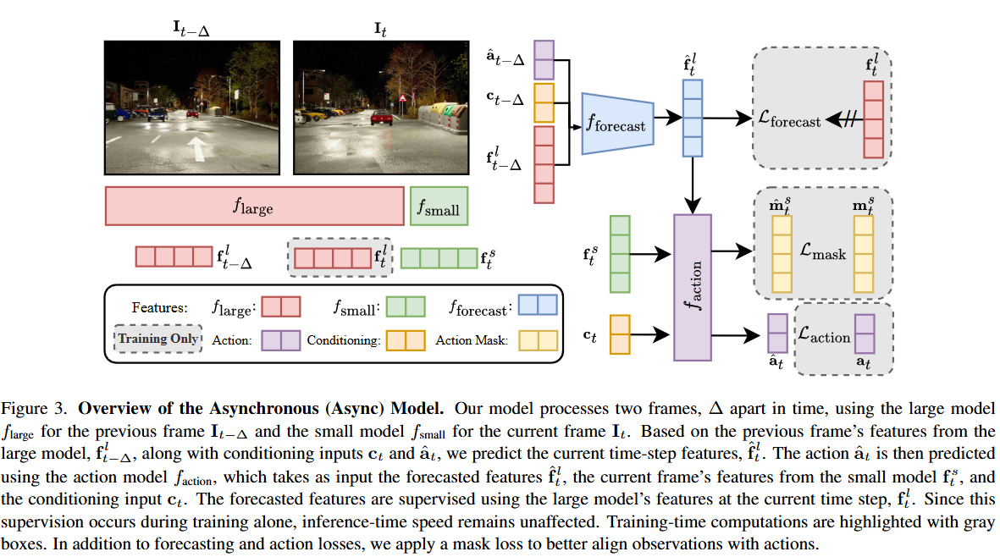
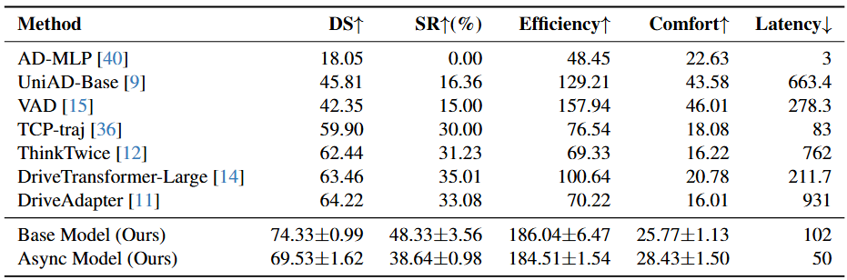

# ETA

## Summary
We propose "Efficiency through Thinking Ahead" (ETA), an asynchronous dual-system that pre-processes information from past frames using a large model in tandem with processing the current information with a small model to enable real-time decisions with strong performance.


## Abstract
How can we benefit from large models without sacrificing inference speed, a common dilemma in self-driving systems? A prevalent solution is a dual-system architecture, employing a small model for rapid, reactive decisions and a larger model for slower but more informative analyses. Existing dual-system designs often implement parallel architectures where inference is either directly conducted using the large model at each current frame or retrieved from previously stored inference results. However, these works still struggle to enable large models for a timely response to every online frame. Our key insight is to shift intensive computations of the current frame to previous time steps and perform a batch inference of multiple time steps to make large models respond promptly to each time step. To achieve the shifting, we introduce Efficiency through Thinking Ahead (ETA), an asynchronous system designed to: (1) propagate informative features from the past to the current frame using future predictions from the large model, (2) extract current frame features using a small model for real-time responsiveness, and (3) integrate these dual features via an action mask mechanism that emphasizes action-critical image regions. Evaluated on the Bench2Drive CARLA Leaderboard-v2 benchmark, ETA advances state-of-the-art performance by 8% with a driving score of 69.53 while maintaining a near-real-time inference speed at 50 ms.

## Results


## Training Setup
### Bench2Drive data
Download the [Bench2Drive](https://github.com/Thinklab-SJTU/Bench2Drive) dataset and unzip all the directories. 

### Libraries
Install the [skit](https://github.com/Shamdan17/skit) toolkit for distributed sampling and training wrappers. More dependencies are listed in the `requirements.txt` file. Install them using pip:

```bash
pip install -r requirements.txt
```

### Config files
Under `carformer/config/user`, create a yaml file following the `example.yaml` example. 

```yaml
dataset_dir: /PATH/TO/DATASET/FOLDER/
working_dir: /PATH/TO/carformer/

wandb_entity: WANDBUSERNAME
```

Furthermore, modify the Makefile to update the username to the config name you just created.

### Training

To train the base and async models on 8 nodes with 4 GPUs each, run the following commands from the `carformer` directory. We run these commands in a SLURM job. Directly using make will not properly parallelize the training across multiple nodes, so modify it accordingly if not working in a SLURM environment.

```bash
make ETA_base_model_s42
make ETA_async_model_s42
```

## Evaluation Setup

### Bench2Drive

[Bench2Drive](https://github.com/Thinklab-SJTU/Bench2Drive) is required for evaluation. Please follow the "Eval Tools" section.

### File setup:

Only follow these steps **AFTER** Bench2Drive is set up following the Bench2Drive instructions. Please place the files found in "misc" and "team_code" in the following structure in the Bench2Drive repo:

```
    Bench2Drive\ 
      assets\
      docs\
      leaderboard\
        leaderboard\
          --> Copy "leaderboard_evaluator_local.py" from the "misc" folder here
        scripts\
          --> Copy "run_eval_leaderboard.py" from the "misc" folder here
        team_code\
          --> Copy files from "team_code" folder here
      scenario_runner\
      tools\
```

### Config file setup:

For evaluation, you need to update the config files under teamcode/config:

```yaml
working_dir: /path/to/Bench2Drive
b2d_path: /path/to/Bench2Drive
```

### Download checkpoints:

Checkpoints uploading is in progress.

### Running the evaluation:

**Note:** Unlike Bench2Drive's setup, this evaluation code requires a separate instance of CARLA running. It will NOT run CARLA for you.

#### Running carla
You can run CARLA on port 30000 persistently (restarts 10 seconds after crashing) with the following command:

```bash
while : ; do ./CarlaUE4.sh -carla-rpc-port=30000 ; sleep 10 ; done
```

#### Running the evaluation
From the Bench2Drive directory, run the following command to evaluate MODEL_NAME using carla at port 30000. Update the "user" to your username.

```bash
python leaderboard/scripts/run_eval_leaderboard.py user=shadi port=30000 trafficManagerPort=20000 experiments=Ponderer viz=0 experiments.ponderer_model_name=MODEL_NAME checkpoint_file=results.json experiments.agent_root=/PATH/TO/CHECKPOINT/MODEL_NAME experiments.root_path=/PATH/TO/CHECKPOINT/MODEL_NAME/ experiments.runnickname=NICKNAMEHERE resume=0 experiments.epoch_num=37
```

## Acknowledgements

This codebase builds on open sourced code from [carla_garage](git@github.com:autonomousvision/carla_garage.git) among others. We thank the authors for their contributions.