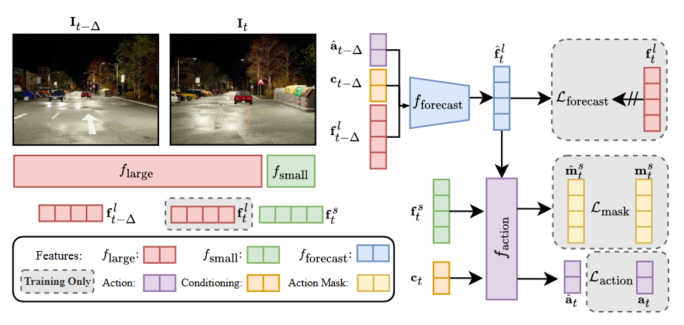

# 🤔 ETA

## Highlight <a name="highlight"></a>
We propose "**E**fficiency through **T**hinking **A**head" (ETA), an asynchronous dual-system that pre-processes information from past frames using a large model in tandem with processing the current information with a small model to enable real-time decisions with strong performance.


## News <a name="news"></a>
- **`[2025/06/10]`** [ETA](https://arxiv.org/abs/2506.07725) paper and code release! 

## Results


## Table of Contents
1. [Highlights](#highlight)
2. [News](#news)
3. [Results](#results)
2. [Getting Started](#gettingstarted)
   - [Training](docs/TRAIN_EVAL.md#trainingsetup)  
   - [Evaluation](docs/TRAIN_EVAL.md#evalsetup)
4. [TODO List](#todolist)
6. [License and Citation](#licenseandcitation)
7. [Other Resources](#otherresources)

## Getting Started <a name="gettingstarted"></a>

Please refer to [TRAIN_EVAL.md](docs/TRAIN_EVAL.md) for detailed instructions on how to train and evaluate the model.

## TODO List
- [x] ETA Training code
- [x] ETA Evaluation
  - [x] Inference Code
  - [ ] Checkpoints

## Acknowledgements

This codebase builds on open sourced code from [CARLA Garage](git@github.com:autonomousvision/carla_garage.git) and [Bench2DriveZoo](https://github.com/Thinklab-SJTU/Bench2DriveZoo/) among others. We thank the authors for their contributions. This project is funded by the European Union (ERC, ENSURE, 101116486) with additional compute support from Leonardo Booster (EuroHPC Joint Undertaking, EHPC-AI-2024A01-060). Views and opinions expressed are however those of the author(s) only and do not necessarily reflect those of the European Union or the European Research Council. Neither the European Union nor the granting authority can be held responsible for them. This study is also supported by National Natural Science Foundation of China (62206172) and Shanghai Committee of Science and Technology (23YF1462000).

## License and Citation <a name="licenseandcitation"></a>
This project is released under the [MIT License](LICENSE). If you find our project useful for your research, please consider citing our paper with the following BibTeX:


```bibtex
@article{hamdan2025eta,
  title={ETA: Efficiency through Thinking Ahead, A Dual Approach to Self-Driving with Large Models},
  author={Hamdan, Shadi and Sima, Chonghao and Yang, Zetong and Li, Hongyang and G{\"u}ney, Fatma},
  journal={arXiv preprint arXiv:2506.07725},
  year={2025}
}
```
